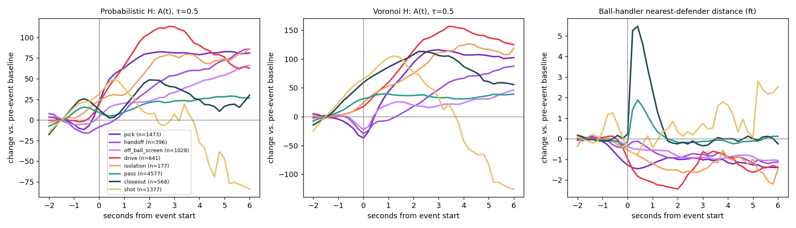
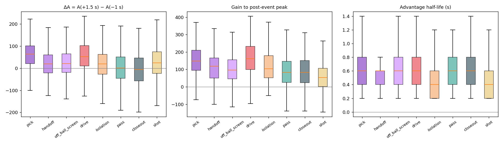
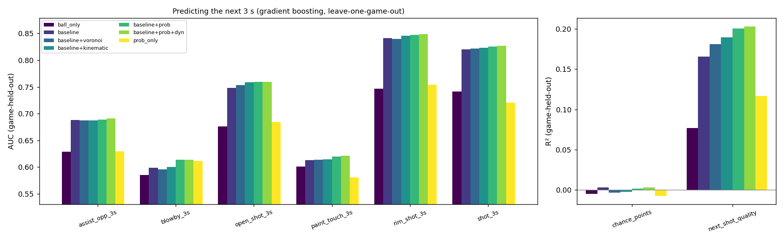
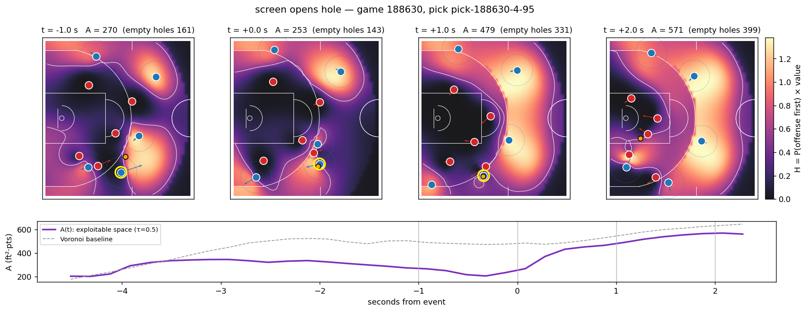
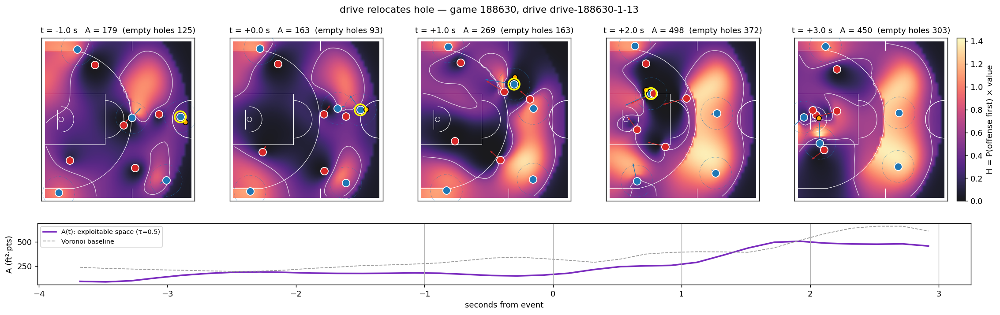
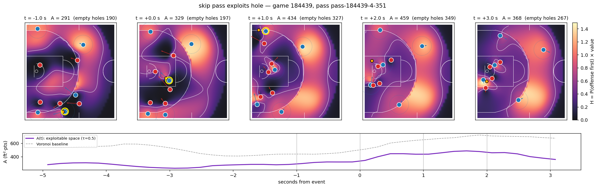
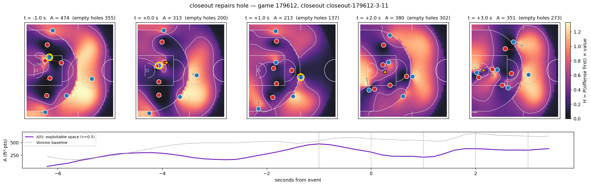
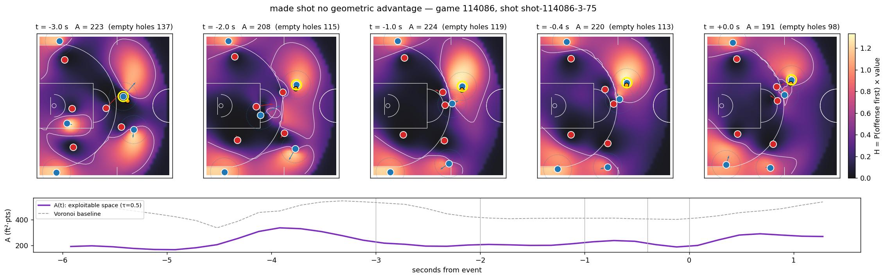
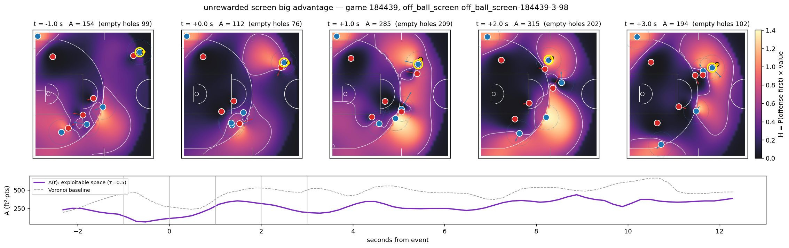
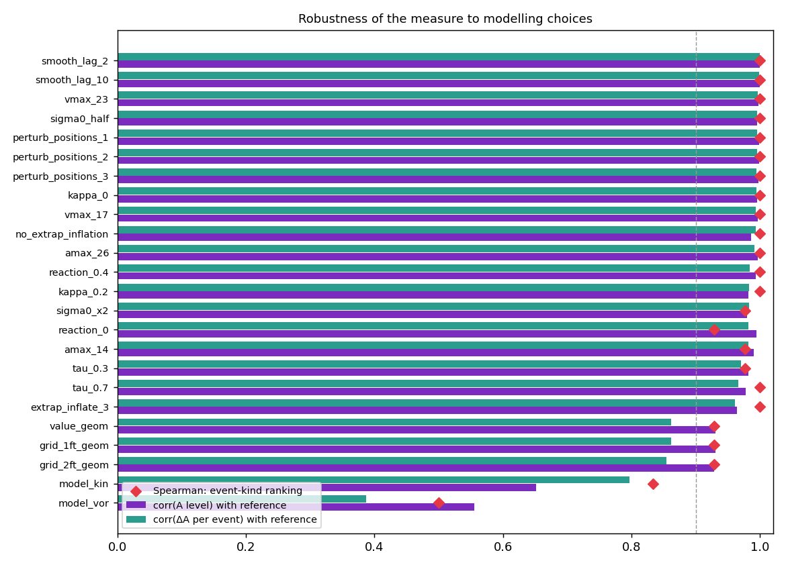

# Holes in the Defense
## A Geometric Currency for Advantage Creation and Recovery from Basketball Tracking Data

### 1. Executive Summary

| Read this first | Takeaway |
| --- | --- |
| **The model** | For every square foot of the offensive half court, the probability that the offense reaches it before the defense (kinematic time-to-arrival with reaction time, acceleration and speed limits fitted from the tracking, Gaussian arrival-time uncertainty driven by SkillCorner's per-position `predError`), times the expected points of an open shot from there. The exploitable-space measure $A$ is the integral of that field above half a point. |
| **It moves the way basketball says** | Relative to random no-action moments, on-ball screens create +50 units and drives +44 (both $p < 10^{-30}$), off-ball screens +12, handoffs +8; passes -8; closeouts, the one defensive action, **-16**. Nine-tenths of what a pick or drive creates is *empty* space nobody stands in yet. |
| **The baselines do not** | Euclidean Voronoi scores a closeout as an offensive *gain* (+23), handoffs as a loss (-20); nearest-defender distance to the ball handler barely moves for any action; convex hull moves the wrong way. Only motion-aware control recovers the coaching ordering. |
| **One currency for coverages** | Fighting over a screen concedes +59 to the offense; switching +36; going under +29. A show concedes more than a drop; a step-up screen (+65) more than a wing screen (+27); a whipped off-ball screen nothing. |
| **It predicts what happens next** | Leave-one-game-out, the field adds +0.04 AUC to a spacing/defender-distance baseline for a shot or an open shot in the next 3 s (logistic), and still adds to a gradient-boosted model for blow-bys (+0.015 AUC) and next-shot quality (+0.03 $R^2$). It does not predict the points the chance ends with (nothing does, $R^2 < 0.005$). |
| **It is robust** | Resampling every position from its stated tracking error, and varying every movement-model constant, the threshold and the grid, keep per-event changes correlated above 0.96 with the reference and the action ranking at or near 1.0. Swapping the control model for Voronoi drops that to 0.39. |
| **What it cannot do** | A skip pass into an existing hole scores negative: the field values space, not the ball. Advantage created does not predict points scored on the chance. Ten games. |

The data are the ten public SkillCorner Liga ACB 2025-26 games (25 Hz tracking, 76,423 half-court frames analysed at 5 Hz, 10,237 marked actions). Everything is reproducible from `scripts/holes/`.

### 2. The Question

Basketball offenses spend possessions trying to reach valuable court space before the defense does. Coaches describe this in terms of *advantage*: a screen puts a defender a step behind, a drive pulls help away from a shooter, a skip pass reaches the side of the floor the defense has vacated, and a closeout or rotation repairs the damage. Box-score events only record the endpoint of that chain. This paper asks whether the chain itself can be measured as a single continuous quantity: **how much valuable court space the offense can reach before the defense, right now**, and how that quantity is created, moved and destroyed by named actions.

The data are the 10 public SkillCorner Liga ACB 2025-26 games: 25 Hz broadcast tracking for all ten players and the ball (with a per-position expected error, `predError`, and a detected/extrapolated flag), aligned to SkillCorner's Dynamic Events (picks, off-ball screens, handoffs, drives, isolations, passes, closeouts, shots, matchups). All fields are computed in the attack frame (offensive hoop at negative $x$), which is recovered from the broadcast frame with each possession's `leftHoop` flag and verified against event locations (maximum discrepancy 0.2 ft).

### 3. The Model

**Time to control.** For each player $i$ and court location $q$ we estimate the arrival time $T_i(q,t)$ with a kinematic model: the player continues at their current velocity for a reaction time of 0.2 s, then accelerates toward $q$ at up to $a_{\max}$ from their current speed component along that line (a player moving away first has to stop), capped at $v_{\max}$. The limits are fitted from the tracking itself: $v_{\max} = 20$ ft/s is the 99.9th percentile of smoothed player speed and $a_{\max} = 20$ ft/s$^2$ the 99th percentile of smoothed acceleration. Velocities are centred finite differences over $\pm 0.2$ s.

**Uncertainty.** Each arrival time is treated as Gaussian, $T_i \sim \mathcal{N}(\mu_i, \sigma_i^2)$, with

$$
\sigma_i^2 = \sigma_0^2 + \left(\frac{\kappa_i\,\mathrm{predError}_i}{v_{\mathrm{ref}}}\right)^2 + (0.1\,\mu_i)^2,
$$

where $\sigma_0 = 0.15$ s is irreducible decision noise, positional error is converted to time through $v_{\mathrm{ref}} = 10$ ft/s, $\kappa_i = 1.5$ for extrapolated (undetected) positions and 1 otherwise, and the last term lets uncertainty grow with distance. Team control is then

$$
C_O(q,t) = P\!\left(\min_{i \in O} T_i(q,t) < \min_{j \in D} T_j(q,t)\right),
$$

evaluated in closed form with Clark's moment-matching recursion for the minimum of Gaussians. On real frames Clark's approximation agrees with a 400-sample Monte Carlo evaluation to a mean absolute error of 0.016 in probability and a correlation of 0.9998 in the resulting advantage measure, at 14x the speed of numerical integration.

Two simpler models are carried as baselines throughout: **Euclidean Voronoi** (nearest player wins, no velocity, no uncertainty) and **velocity-aware time-to-arrival** (the same kinematic $\mu_i$, deterministic winner).

**Value.** The value of controlling $q$ is the expected points of an *open* shot from $q$. We use a parametric map (rim 1.35 pts falling to 0.85 at 15 ft, 1.05 at the three-point line falling to 0.35 at 35 ft, zero in the backcourt) and an empirical map: open and lightly-contested shots from the other nine games, kernel-smoothed (5 ft bandwidth, mirrored across the court axis, two-point and three-point regions kept separate) and shrunk toward the parametric map where data are thin. The empirical map is refitted leave-one-game-out so that no game's own shots inform its field. A third variant multiplies the value by a ball-reachability discount, $\exp(-(d_{\mathrm{ball}} - 8)_+/25)$.

**The exploitable-space field and its summaries.** $H(q,t) = C_O(q,t)\,V(q)$ on a 1 ft grid of the offensive half court, sampled at 5 Hz on live half-court frames (clock running, chance already in the frontcourt): 76,423 frames across the ten games (after excluding the blind frames described below). The primary scalar is

$$
A(t) = \int \max\!\left(0,\, H(q,t) - \tau\right) dq, \qquad \tau = 0.5,
$$

which counts only space that is both likely offensive *and* worth at least half a point. We also track the total integral, the maximum, the mass of the largest connected high-value region, near-rim / corner / three-point / paint masses, the number of separate holes, and a split of $A$ into space within 5 ft of an offensive player (**occupied**: an open player standing in valuable space the defense cannot take from them) versus space more than 5 ft from *every* offensive player (**empty hole**: valuable space nobody is standing in, but which an attacker who cut or drove there would reach before any defender). The empty-hole part is the geometric footprint of a defender being out of position; the occupied part is a player being open. The 5 ft radius is roughly one stride plus an arm; section 4.6 varies the other constants, and the split is only used descriptively.

**Event alignment.** For an action starting at $t_0$ we report $\Delta A = \bar A[t_0, t_0+1.5\,\mathrm{s}] - \bar A[t_0-1\,\mathrm{s}, t_0]$, the gain to the peak within 3 s, and the half-life: the time from the peak until $A$ has fallen halfway back to its pre-event level (infinite if it never does within 3 s). A **null** control of random live frames at least 1 s from any marked event is run through the same machinery. Frames where the tracking is essentially blind (eight or more players extrapolated, or mean expected error above 4 ft; 1.4% of half-court frames) are excluded from every statistic, because there $C_O$ collapses to 0.5 everywhere and $A$ to zero.

### 4. Results

#### 4.1 The field moves the way basketball says it should

{ width=100% }

Table 1 gives $\Delta A$ (mean change from the second before the action to the 1.5 s after it) for every marked action across the ten games, next to the no-action null. The null drifts upward by about 11 units because $A$ rises as the shot clock runs down; the interesting quantity is the excess over that drift.

| Action | n | $\Delta A$ | excess over null | $P(\Delta A>0)$ | hole part | occupied part |
| --- | --- | --- | --- | --- | --- | --- |
| Pick (on-ball screen) | 1196 | +60.7 | **+49.8** | 0.84 | +43.5 | +6.2 |
| Drive | 512 | +55.1 | **+44.2** | 0.80 | +40.0 | +4.2 |
| Off-ball screen | 838 | +22.7 | +11.7 | 0.63 | +12.4 | -0.7 |
| Isolation | 146 | +20.2 | +9.2 | 0.56 | +6.0 | +3.2 |
| Handoff | 325 | +18.8 | +7.9 | 0.61 | +9.1 | -1.2 |
| Pass | 2676 | +2.8 | -8.2 | 0.50 | -7.4 | -0.7 |
| Closeout (defensive) | 453 | -4.6 | **-15.6** | 0.46 | -11.8 | -3.8 |
| No action (null) | 1352 | +10.9 | 0 | 0.55 | --- | --- |

Units are ft$^2\cdot$pts of space above the $\tau = 0.5$ threshold; 'hole' and 'occupied' split the change into space more than 5 ft from every offensive player and space next to one. Against the null, picks ($p = 2\times10^{-71}$), drives ($p = 6\times10^{-31}$), off-ball screens ($p = 1\times10^{-4}$), closeouts ($p = 2\times10^{-4}$) and passes ($p = 9\times10^{-4}$) differ by Mann-Whitney; handoffs ($p = 0.06$) and isolations ($p = 0.18$) do not.

Three things stand out. First, the ordering is the one a coach would give: on-ball screens and drives are the advantage-creating actions, off-ball screens and handoffs create smaller advantages, and closeouts --- the one defensive action in the table --- are the only action that *destroys* advantage. Second, almost all of the advantage created by a pick or a drive appears in **holes**: space nobody is standing in yet, not space around an already-open player. The measure is capturing the defense being pulled out of position, not merely a player becoming open. Third, a pass on average does not create advantage; it slightly loses it (the ball travels, and the defense uses the flight time). This is consistent with the view that passes *cash in* advantage created earlier rather than create it.

{ width=100% }

{ width=100% }

**The baselines miss this.** The same event alignment on Euclidean Voronoi control (Table 2) puts closeouts at *+23* over null --- a closing-out defender running toward the ball handler gives up Voronoi area behind them, so the area measure calls a defensive recovery an offensive gain --- and handoffs at -20. The nearest-defender distance to the ball handler barely moves for any action (all $|\Delta| < 4$ ft), and the offensive convex hull moves in the wrong direction for drives and picks (it shrinks). Only the models that account for motion (kinematic and probabilistic) recover the basketball ordering.

| Measure | Pick | Drive | Off-ball screen | Handoff | Closeout | Pass |
| --- | --- | --- | --- | --- | --- | --- |
| Probabilistic $A$ | +49.8 | +44.2 | +11.7 | +7.9 | **-15.6** | -8.2 |
| Kinematic $A$ | +70.8 | +60.3 | +4.1 | +5.3 | -14.9 | -14.8 |
| Voronoi $A$ | +26.9 | +24.8 | +0.6 | -20.1 | **+23.2** | +1.4 |
| Ball-handler nearest-defender distance (ft) | +0.3 | -1.0 | +0.5 | +0.7 | +4.0 | +1.9 |
| Offensive convex hull (ft$^2$) | -12 | -63 | +36 | +52 | +4 | +27 |

(Excess over the null for each measure.)

**Recovery.** After the post-event peak, $A$ falls halfway back to its pre-event level within a median of 0.6 s for picks, drives, handoffs and off-ball screens --- the defense repairs most holes quickly. But the fraction that is *not* repaired within 3 s differs: 68% of drive-created advantage and 54% of pick-created advantage survives 3 s, against 54% for the null and 47% for closeouts. Drives are the action whose advantage most often outlives the defense's reaction, which is why they end in shots.

#### 4.2 Does the field predict what happens next?

A geometric measure that merely relabels court position would add nothing to a model that already knows where the ball and the defenders are. We therefore predict, from each half-court frame, what happens in the next 3 s of the same chance, with nested feature sets and leave-one-game-out cross-validation (train on nine games, test on the tenth, ten folds; no random splitting of neighbouring frames). The baseline set has 16 features: ball and handler position, distance to the rim, shot clock, nearest-defender distance to the handler, mean and maximum nearest-defender distances, number of players with more than 6 ft of space, offensive and defensive convex hulls, offensive spread and depth, defensive depth, and mean speeds. The field sets add the summaries of $H$ under each control model.

| Target (next 3 s) | rate | ball only | baseline | + Voronoi | + kinematic | + probabilistic | + prob. + 1 s dynamics | prob. only |
| --- | --- | --- | --- | --- | --- | --- | --- | --- |
| Any shot | 0.24 | 0.660 | 0.722 | 0.731 | 0.741 | **0.766** | 0.768 | 0.685 |
| Open / light-contest shot | 0.06 | 0.606 | 0.699 | 0.712 | 0.723 | **0.740** | 0.741 | 0.660 |
| Shot within 6 ft of the rim | 0.08 | 0.724 | 0.775 | 0.776 | 0.785 | **0.797** | 0.800 | 0.725 |
| Blow-by | 0.02 | 0.599 | 0.619 | 0.607 | 0.628 | 0.615 | 0.618 | 0.592 |
| Assist opportunity | 0.11 | 0.539 | 0.606 | 0.615 | 0.617 | **0.651** | 0.652 | 0.623 |
| Paint touch | 0.14 | 0.523 | 0.578 | 0.583 | 0.585 | **0.617** | 0.616 | 0.590 |

Table 3: leave-one-game-out AUC, logistic regression. Per-game standard deviations of the AUC are 0.01-0.04.

With a linear model the ordering is monotone in model sophistication for every target except blow-bys: Voronoi adds a little to the baseline, the kinematic field adds more, and the probabilistic field adds most --- +0.04 AUC on shots and open shots, +0.045 on assist opportunities and paint touches. The field's own summaries, with no ball or defender information at all, predict a shot in the next 3 s at 0.69 AUC.

A gradient-boosted model narrows the gap, as it should: with enough trees it can reconstruct spatial structure from raw coordinates and defender distances.

| Target (next 3 s) | baseline | + Voronoi | + kinematic | + probabilistic | + prob. + dynamics |
| --- | --- | --- | --- | --- | --- |
| Any shot | 0.820 | 0.822 | 0.824 | 0.825 | 0.827 |
| Open / light-contest shot | 0.748 | 0.754 | 0.759 | 0.759 | 0.760 |
| Shot within 6 ft of the rim | 0.841 | 0.840 | 0.846 | 0.847 | 0.849 |
| Blow-by | 0.599 | 0.596 | 0.600 | **0.614** | 0.614 |
| Assist opportunity | 0.688 | 0.687 | 0.687 | 0.689 | 0.691 |
| Paint touch | 0.613 | 0.614 | 0.615 | 0.620 | 0.621 |
| Quality of the next shot ($R^2$) | 0.166 | 0.181 | 0.189 | **0.200** | 0.203 |

Table 4: the same, with gradient boosting (AUC; last row $R^2$ on SkillCorner `shotQuality` of the next shot, $n = 18{,}378$ frames with a shot in the window).

Even here the field survives: blow-bys (+0.015 AUC, the one target that is *about* a defender being beaten to a spot) and the quality of the upcoming shot (+0.034 $R^2$; +0.019 over Voronoi) are better predicted with the probabilistic field, and nothing is predicted worse. Adding the one-second change in $A$ adds essentially nothing on top of the level, so the level of exploitable space, not its momentum, is what carries the information.

Two negative results belong in the record. The points scored on the chance are not predictable from any frame-level feature set ($R^2 \le 0.004$ for every model): what happens in the next three seconds is geometric, what happens by the end of the chance is not. And blow-bys are rare (2.3% of frames) and noisy enough that the linear model does not separate the feature sets.

{ width=100% }

#### 4.3 One currency for screens, drives, passes and closeouts

Because every action is scored on the same field, their values can be compared directly, and split by the context labels SkillCorner attaches to them. The splits behave the way the coaching vocabulary says they should.

| Context | n | excess $\Delta A$ over null | 95% CI on $\Delta A$ |
| --- | --- | --- | --- |
| Pick, handler defended *over* | 775 | **+58.6** | [65.1, 73.7] |
| Pick, defense *switches* | 168 | +35.7 | [36.4, 56.5] |
| Pick, handler defended *under* | 219 | +29.4 | [32.6, 47.9] |
| Pick, screener's man *shows* | 485 | +58.0 | [63.6, 74.5] |
| Pick, screener's man plays *soft* (drop) | 504 | +46.6 | [52.3, 62.6] |
| Pick at the *step-up* | 154 | **+64.6** | [65.0, 85.6] |
| Pick in the *middle* | 734 | +55.5 | [62.1, 70.7] |
| Pick on the *wing* | 288 | +27.3 | [30.8, 45.5] |
| Off-ball screen, cutter *trailed* | 441 | +18.6 | [23.6, 35.6] |
| Off-ball screen, cutter *whipped* (defender beats the cutter through) | 319 | +0.7 | [4.5, 18.9] |
| Off-ball screen, screener's man *shows* | 47 | **+49.9** | [40.4, 81.3] |
| Off-ball screen, screener's man *drops* | 594 | +9.2 | [14.9, 25.1] |
| Drive created by a pick | 260 | +49.8 | [52.9, 68.6] |
| Drive created by an isolation | 62 | +20.3 | [16.0, 46.7] |
| Pass under 12 ft | 642 | +2.4 | [7.8, 18.9] |
| Pass 20-30 ft | 650 | -19.2 | [-14.3, -2.2] |
| Pass over 30 ft (skip) | 133 | -21.6 | [-23.5, 2.5] |
| Pass that is an assist opportunity | 538 | +8.3 | [11.9, 26.6] |
| Closeout followed by a shot | 215 | -12.2 | [-13.1, 9.7] |
| Closeout followed by a pass | 83 | -22.8 | [-30.1, 5.9] |

Switching and going under both cost the offense roughly 25 units relative to the defender fighting over the screen; a show on the screener creates more space for the offense than a drop (the showing big leaves the paint); a step-up screen in the middle of the floor is the most productive on-ball action in the data; a whipped off-ball screen creates nothing. Passes get worse with length --- longer flight time lets the defense recover --- and the skip pass, which coaches value precisely because it exploits an existing hole, registers as *negative* on this measure. That is an honest limitation of a field that values *space* rather than *ball position*: a skip pass does not create a new hole, it moves the ball into one that already exists. Section 4.4 shows what that looks like frame by frame.

**Does created advantage convert?** Within an action kind, $\Delta A$ does not predict the points scored on the chance (Spearman $\rho$ between $-0.08$ and $+0.03$ for picks, off-ball screens, drives, passes and handoffs; all $p > 0.06$). Advantage creation and advantage *use* are different skills, and the field only measures the first. Pre-shot advantage does relate to how SkillCorner grades the resulting shot: $A$ in the second before release correlates with `shotQuality` at $\rho = 0.22$ ($p = 8\times10^{-11}$, $n = 892$), while the ball handler's nearest-defender distance in the same window does not ($\rho = -0.15$).

#### 4.4 What the field looks like possession by possession

Each panel below shows $H(x,y,t)$ (bright = space the offense will reach first and that is worth shooting from), the ten players with velocity arrows, the ball, the ball handler (yellow ring), the 5 ft occupancy radius around each attacker (dotted) and the $	au = 0.5$ contour of $H$ (white), so that bright space outside every dotted circle is an empty hole, with $A(t)$ for the whole chance underneath against the Voronoi baseline. Examples were chosen automatically: the 85th-97th percentile of gain within their action kind, clean tracking (no more than one extrapolated player, mean expected error under 2 ft), and distinct possessions.

{ width=100% }

{ width=100% }

{ width=100% }

{ width=100% }

{ width=100% }

{ width=100% }

#### 4.5 Holes as objects: birth, lifetime and use

Treating each connected region of $\{H > 0.5\}$ that lies more than 5 ft from every offensive player as a *hole* and linking holes across consecutive 5 Hz samples by overlap gives 15,795 holes across the ten games. Most are short-lived: the median lifetime is 0.6 s, the mean 2.0 s, and the 90th percentile 5.6 s. Only 8% of holes are ever entered by the ball before they close, but use is sharply concentrated in the durable and large ones: holes that survive 2.4 s are used 30% of the time and holes in the top mass tercile 24% of the time, against essentially zero for holes that live under 1.2 s. Holes born in the second after an off-ball screen (mean lifetime 1.5 s, mean mass 56) or a handoff (1.4 s, 50) last longer than those born after a drive (0.7 s, 32) or in the null (1.2 s, 38): off-ball actions open space that is *waiting*, drives open space that is *closing*.

#### 4.6 Robustness

For 1,010 event windows (up to 40 per action kind from four games) the pre- and post-event fields were recomputed under 24 alternative configurations and compared with the reference run on three things: the correlation of the pre-event level $A$, the correlation of the per-event $\Delta A$, and the Spearman rank correlation of the eight action kinds ordered by mean $\Delta A$.

| Perturbation | corr($A$) | corr($\Delta A$) | kind ranking | sign agreement |
| --- | --- | --- | --- | --- |
| Positions resampled from their `predError` (3 draws) | 0.998 | 0.995-0.996 | 1.00 | 0.97 |
| No inflation of extrapolated positions / 3x inflation | 0.986 / 0.965 | 0.993 / 0.961 | 1.00 / 1.00 | 0.98 / 0.96 |
| Decision noise $\sigma_0$ halved / doubled | 0.995 / 0.980 | 0.996 / 0.983 | 1.00 / 0.98 | 0.98 / 0.95 |
| Distance-growth $\kappa$ = 0 / 0.2 | 0.996 / 0.982 | 0.994 / 0.983 | 1.00 / 1.00 | 0.98 / 0.95 |
| $v_{\max}$ 17 / 23 ft/s | 0.996 / 0.998 | 0.994 / 0.997 | 1.00 / 1.00 | 0.97 / 0.97 |
| $a_{\max}$ 14 / 26 ft/s$^2$ | 0.990 / 0.997 | 0.982 / 0.991 | 0.98 / 1.00 | 0.94 / 0.96 |
| Reaction time 0 / 0.4 s | 0.994 / 0.994 | 0.982 / 0.984 | 0.93 / 1.00 | 0.94 / 0.94 |
| Velocity window $\pm 0.08$ s / $\pm 0.4$ s | 1.000 / 1.000 | 1.000 / 0.999 | 1.00 / 1.00 | 1.00 / 0.99 |
| Threshold $\tau$ = 0.3 / 0.7 | 0.981 / 0.977 | 0.971 / 0.967 | 0.98 / 1.00 | 0.92 / 0.91 |
| Grid 2 ft instead of 1 ft | 0.999 | 0.999 | 1.00 | --- |
| Parametric value map instead of empirical | 0.930 | 0.862 | 0.93 | 0.84 |
| Kinematic (deterministic) control instead of probabilistic | 0.651 | 0.797 | 0.83 | 0.82 |
| Euclidean Voronoi control | 0.556 | 0.387 | 0.50 | 0.65 |

(Grid-resolution row compares the 1 ft and 2 ft grids under the same value map.)

{ width=88% }

The conclusions are insensitive to everything the tracking or the movement model could plausibly be wrong about. Drawing every player's position from a Gaussian with the tracking's own stated 90% error leaves the action ranking untouched and the per-event $\Delta A$ correlated at 0.995 with the reference; the mean $\Delta A$ for picks moves from 59.9 to 59.2-60.8 and for closeouts from -2.1 to between -1.1 and -1.8. Halving or doubling the noise terms, moving the speed and acceleration limits by $\pm 15$-30%, removing the reaction time, changing the velocity window five-fold, and coarsening the grid all keep $\Delta A$ correlated above 0.96 and the ranking at or near 1.0. Even the threshold $\tau$, which changes the level of $A$ by a factor of four between 0.3 and 0.7, leaves per-event changes correlated at 0.97.

The two choices that matter are the ones that should: which value map is used (parametric vs. empirical, $\Delta A$ correlation 0.86, ranking 0.93 --- the maps disagree about how much the corners and the rim are worth) and which control model. Replacing the probabilistic field by the deterministic kinematic one drops the $\Delta A$ correlation to 0.80 and the ranking to 0.83; replacing it by Voronoi drops them to 0.39 and 0.50, and, as in section 4.1, flips the sign of closeouts (Voronoi mean $\Delta A$ for closeouts in these windows: +38). The uncertainty-aware field is not a cosmetic smoothing of the Voronoi diagram; it ranks the actions differently, and in the order basketball expects.

The one approximation inside the model, Clark's closed form for the minimum of Gaussian arrival times, was checked against Monte Carlo on real frames: mean absolute error 0.016 in control probability, correlation 0.9998 in $A$.

### 5. What the Measure Does Not Do

* **It values space, not the ball.** A skip pass into an existing hole scores negative because the hole was already there and the flight time lets the defense move. A ball-conditioned variant (value discounted by distance from the ball) was carried through every analysis and behaves the same way; a proper treatment needs a passing model, which is beyond what ten games support.
* **Creation is not conversion.** Within an action kind, the advantage created does not predict the points scored on the chance. The field measures what the offense opened, not whether it used it, and the two are different skills.
* **Three seconds, not a possession.** The field predicts the next three seconds well and the chance outcome not at all. It is a description of state, not a possession-level valuation.
* **Defensive intent is invisible.** Control is computed from where defenders are and how they are moving; a defender deliberately sagging off a non-shooter registers as a hole. The empirical value map partly corrects for this (it is fitted on where open shots actually score) but not by player.
* **The arrival-time model is simple.** One reaction time, one acceleration limit and one top speed for every player, no fatigue, no size, no on-ball slowdown for the dribbler. The robustness section shows the conclusions do not depend on the exact numbers, but a player-specific model would sharpen the field.
* **Ten games.** Every coverage split in Table 5 has a wide interval, and the per-game spread of the validation AUCs (0.01-0.04) is the honest size of the uncertainty on those numbers.

### 6. Conclusion

A basketball possession can be described as the creation, movement and closure of valuable holes in the defense, and that description can be computed from broadcast tracking with an interpretable model: a kinematic time-to-arrival for every player, a Gaussian treatment of the tracking's own stated error, a closed-form probability that the offense reaches each square foot first, and a court-value map. The resulting scalar, the amount of likely-offensive space worth at least half a point, rises after the actions that coaches call advantage-creating (picks +50, drives +44 relative to no action, almost entirely in unoccupied space), falls after the one defensive action in the data (closeouts, -16), separates coverages the way the coaching vocabulary does (over > switch > under; show > drop; step-up > middle > wing), predicts the next three seconds of the possession better than ball position, defender distance, convex hulls and Voronoi area, and is stable under perturbation of positions by their expected error and under every modelling choice we varied. The Euclidean Voronoi diagram that the model is built to replace gets the sign of a closeout wrong.

The same currency scores the offense's screens and drives and the defense's repairs. What it does not yet do is tell the offense which hole to use: the measure's next step is a passing model on top of the field, so that a skip pass into an open corner is credited for what it exploits rather than debited for the time it takes.

### Appendix: Reproduction

All code is in `spaceholes/` (library) and `scripts/holes/` (stages 01-08); `scripts/holes/README.md` lists the commands. Stage 1 caches the tracking (`data/processed/holes/`), computes the three control fields, the value maps (leave-one-game-out) and 165 per-frame summaries at 5 Hz (`outputs/holes/frames_{game}.parquet`, about 4 minutes per game); stage 2 aligns them to events; stage 3 runs the held-out prediction; stage 4 the perturbation study; stages 5-6 the figures; stage 7 the action-value tables; stage 8 the hole tracking. The data are the public SkillCorner release (MIT licence), cloned into `data/external/opendata-basketball`.

